# Proyecto Final

## API REST Segura para la Gestión de Eventos Académicos

### Integrantes

| Integrante | Correo | GitHub |
|------------|--------|--------|
| Orellana Mateo | morellana1@est.ups.edu.ec | MateOrellana |
| Alvarado Sebastian | salvaradom1@est.ups.edu.ec | sebmrd |

---

## 1. Resumen del Proyecto

Este proyecto implementa una API REST segura para la gestión de eventos académicos. El sistema permite administrar usuarios, roles, categorías, eventos, sesiones, inscripciones, reportes y estadísticas. La solución fue desarrollada con Spring Boot, PostgreSQL, Redis, Spring Security, JWT, Flyway, Swagger/OpenAPI, Actuator, Docker y Render.

El objetivo principal fue construir un backend robusto y desplegable, con autenticación, autorización por roles, validación de propiedad de recursos, reglas de negocio, manejo centralizado de excepciones, rate limiting, reportes descargables y evidencias de funcionamiento en local y producción.

---

## 2. Tecnologías Utilizadas

| Área | Tecnología |
|------|------------|
| Backend | Java 17, Spring Boot 4.x |
| API REST | Spring Web |
| Persistencia | Spring Data JPA |
| Base de datos | PostgreSQL 15 |
| Migraciones | Flyway |
| Seguridad | Spring Security, JWT, BCrypt |
| Caché temporal y límites | Redis |
| Documentación | Springdoc OpenAPI, Swagger UI |
| Reportes | Apache POI, OpenPDF |
| Observabilidad | Spring Boot Actuator |
| Pruebas | JUnit, Mockito |
| Contenedores | Docker, Docker Compose |
| Despliegue | Render |

---

## 3. Cumplimiento de los Puntos del Proyecto

### Punto 1. Arquitectura general

El backend se organizó como un monolito modular por dominios. La estructura separa controladores, servicios, repositorios, entidades, DTO y configuraciones. Los dominios principales son:

- `users`: usuarios, roles, autenticación y administración.
- `events`: categorías y eventos académicos.
- `registrations`: sesiones, inscripciones y auditoría.
- `reports`: reportes PDF/Excel y estadísticas.
- `security`: filtros JWT, Swagger Basic Auth y autorización por propiedad.
- `config`: CORS, OpenAPI, rate limiting y configuración web.
- `exception`: respuestas uniformes de error.

El mapeo entre entidades y respuestas se realiza mediante DTO de entrada/salida y métodos de conversión como `from(...)`, evitando exponer directamente las entidades JPA en la API.

Evidencia documentada: `assets/evidencia-01-arquitectura-paquetes.png`.

### Punto 2. Modelo de datos

La base de datos contiene las tablas principales solicitadas: `users`, `roles`, `user_roles`, `categories`, `events`, `sessions`, `registrations`, `refresh_tokens` y `audit_logs`. El esquema se inicializa con Flyway y se valida desde JPA con `ddl-auto=validate`, evitando que Hibernate cree o modifique tablas automáticamente.

También se agregó el script `00_create_database.sql` para crear la base `academic_events_db`, y la migración principal crea tablas, relaciones, restricciones, índices y datos iniciales.

Evidencia documentada: `assets/evidencia-02-tablas-postgresql.png`.

### Punto 3. Roles y permisos

El sistema maneja tres roles:

| Rol | Responsabilidad |
|-----|-----------------|
| `ADMIN` | Administra usuarios, categorías, eventos, inscripciones y reportes globales. |
| `ORGANIZER` | Gestiona únicamente sus propios eventos, sesiones e inscripciones. |
| `PARTICIPANT` | Consulta eventos, se inscribe, cancela sus inscripciones y descarga comprobantes propios. |

Además del rol, se valida la propiedad del recurso con `ResourceAuthorizationService`. Por ejemplo, un organizador no puede modificar eventos de otro organizador y un participante no puede descargar certificados ajenos.

Evidencia documentada: `assets/evidencia-03-roles-403.png`.

### Punto 4. Flujo funcional y endpoints mínimos

Se implementaron los flujos principales de la API:

- Autenticación: registro, login, refresh, logout y perfil.
- Usuarios: listado y cambio de estado por administrador.
- Categorías: listar, crear, actualizar y desactivar.
- Eventos: listar con filtros, consultar detalle, crear, actualizar, cambiar estado y eliminar.
- Sesiones: listar, crear, actualizar y eliminar sesiones por evento.
- Inscripciones: inscribirse, listar propias, cancelar, listar inscritos por evento y actualizar estado.
- Reportes: PDF, Excel, certificado y estadísticas.

Evidencia documentada: `assets/evidencia-04-swagger-endpoints.png`.

### Punto 5. Autenticación y autorización

La autenticación usa JWT. El `accessToken` tiene expiración corta y el `refreshToken` se almacena hasheado en base de datos. Al renovar el token se rota el refresh token anterior, quedando revocado.

Las contraseñas se almacenan con BCrypt. Los endpoints protegidos usan Spring Security y reglas `@PreAuthorize`. Los mensajes de autenticación son genéricos para no revelar si un correo existe.

Evidencia documentada: `assets/swagger-login.png`.

Evidencia documentada adicional: `assets/evidencia-05-refresh-logout.png`.

### Punto 6. Redis y rate limiting

Redis se usa solo como almacenamiento temporal, no como fuente principal de datos. Se utiliza para:

- Contadores temporales de solicitudes.
- Bloqueo temporal por intentos fallidos de login.
- Claves con prefijos como `rate:` y `blocked-user:`.
- TTL en claves temporales.

Si Redis no está disponible en desarrollo local, la API evita caerse completamente y permite continuar pruebas básicas.

Evidencia documentada: `assets/evidencia-06-redis-keys.png`.

### Punto 7. Límites de solicitudes

El rate limiting incrementa contadores por IP o usuario antes de procesar solicitudes. Si se supera el límite, la API responde `429 Too Many Requests` e incluye el header `Retry-After`.

Límites configurados:

| Operación | Identificador | Límite |
|-----------|---------------|--------|
| Login | IP | 5 por minuto |
| Registro | IP | 3 por hora |
| Endpoints públicos | IP | 60 por minuto |
| Endpoints autenticados | Usuario | 120 por minuto |
| Reportes | Usuario | 5 por minuto |

Evidencia documentada: `assets/evidencia-07-rate-limit-429.png`.

### Punto 8. CORS restringido

CORS se configura desde la variable `ALLOWED_ORIGINS`. Se restringen métodos a `GET`, `POST`, `PUT`, `PATCH`, `DELETE` y `OPTIONS`, y se permiten solo headers necesarios como `Authorization` y `Content-Type`.

En producción no se usa `*`; en `render.yaml` se define un dominio especifico.

La configuración queda documentada en `render.yaml`, donde `ALLOWED_ORIGINS` se define con un dominio concreto para producción.

### Punto 9. Reglas de negocio y transacciones

Se implementaron reglas de negocio como:

- No permitir correos duplicados.
- No permitir categorías duplicadas.
- No permitir doble inscripción del mismo participante al mismo evento.
- No permitir inscripciones fuera del período habilitado.
- No permitir inscripciones en eventos no publicados.
- No permitir inscripciones sin cupos disponibles.
- Actualizar disponibilidad dentro de transacciones.
- No eliminar físicamente eventos publicados con inscripciones; se aplica eliminado lógico.
- Listados con paginación, filtros y búsqueda.

Evidencia documentada: `assets/evidencia-09-regla-negocio-duplicado.png`.

### Punto 10. Manejo centralizado de excepciones

Se implementó `GlobalExceptionHandler` con respuestas uniformes que incluyen:

- `timestamp`
- `status`
- `internalCode`
- `message`
- `path`

Se manejan errores de validación, autenticación, acceso prohibido, reglas de negocio y exceso de solicitudes.

Evidencia documentada: `assets/evidencia-10-error-validacion.png`.

### Punto 11. Swagger y OpenAPI protegidos

Swagger UI está disponible y protegido con autenticación Basic. Las credenciales se configuran por variables de entorno:

- Usuario: `evaluator`
- Contraseña: `evaluator123`

Dentro de Swagger se configura el esquema Bearer JWT para probar endpoints protegidos.

Evidencias documentadas:

- `assets/evidencia-04-swagger-endpoints.png`
- `assets/swagger-2.png`
- `assets/swagger-login.png`
- `assets/evidencia-11-swagger-basic-auth.png`

### Punto 12. Actuator y observabilidad

Se agregó Spring Boot Actuator y se expone públicamente solo `/actuator/health`, sin detalles internos del sistema. Esto permite comprobar que la API está disponible localmente o en producción.

Evidencia documentada: `assets/actuator-health.png`.

### Punto 13. Reportes, estadísticas y archivos descargables

El módulo de reportes genera archivos bajo demanda y respeta roles y propiedad de eventos.

Endpoints implementados:

| Endpoint | Acceso | Resultado |
|----------|--------|-----------|
| `GET /api/reports/events/{eventId}/registrations.pdf` | ADMIN u organizador propietario | PDF de inscritos. |
| `GET /api/reports/events/{eventId}/registrations.xlsx` | ADMIN u organizador propietario | Excel de inscritos. |
| `GET /api/registrations/{id}/certificate.pdf` | Participante propietario | Comprobante de inscripción confirmada. |
| `GET /api/reports/statistics?from=...&to=...` | ADMIN | Estadísticas globales. |
| `GET /api/reports/events/{eventId}/statistics?from=...&to=...` | ADMIN u organizador propietario | Estadísticas de un evento. |

Los archivos responden con `Content-Type` y `Content-Disposition` para descarga.

Evidencias documentadas:

- `assets/evidencia-13-reporte-pdf.png`: descarga de inscritos en PDF.
- `assets/evidencia-13-reporte-excel.png`: descarga de inscritos en Excel.
- `assets/evidencia-13-certificado-confirmado.png`: certificado de una inscripción `CONFIRMED`.
- `assets/evidencia-13-estadisticas.png`: respuesta JSON de estadísticas con rango de fechas.

### Punto 14. Pruebas, cliente de prueba y evidencias

Aunque la guía no incluye un encabezado numerado como punto 14, los entregables solicitan pruebas, evidencias y un cliente de prueba. Por eso se incluyó una colección en `bruno/Coleccion_Eventos_Academicos.json` con endpoints principales para autenticación, eventos, inscripciones y reportes.

También se ejecutaron pruebas con Gradle:

```powershell
.\gradlew.bat clean test --console=plain
```

Evidencia documentada: `assets/evidencia-14-gradle-build-success.png`.

### Punto 15. Despliegue

El backend se despliega con Docker en Render. El repositorio incluye:

- `Dockerfile`
- `render.yaml`

Render crea o conecta servicios separados para:

- Backend Spring Boot.
- PostgreSQL.
- Redis.

La JVM se limita con `JAVA_TOOL_OPTIONS` para evitar exceder recursos de la instancia gratuita.

Evidencias incluidas:

- `assets/actuator-health.png`
- `assets/endpoint-exitoso.png`

### Punto 16. Variables de entorno

Las credenciales y configuraciones sensibles se manejan con variables de entorno. El archivo `.env.example` documenta las variables necesarias para desarrollo local, sin publicar el `.env` real.

Variables principales:

- `DB_HOST`
- `DB_PORT`
- `DB_NAME`
- `DB_USERNAME`
- `DB_PASSWORD`
- `REDIS_HOST`
- `REDIS_PORT`
- `REDIS_PASSWORD`
- `JWT_SECRET`
- `JWT_ACCESS_EXPIRATION`
- `JWT_REFRESH_EXPIRATION`
- `ALLOWED_ORIGINS`
- `PORT`
- `SWAGGER_USERNAME`
- `SWAGGER_PASSWORD`

En Render, `JWT_SECRET` se genera con `generateValue: true`. La configuración sensible queda fuera del repositorio y se documenta mediante `.env.example` y `render.yaml`.

### Punto 17. Zona horaria

La API trabaja con `Instant` y configura Hibernate con zona horaria UTC:

```yaml
hibernate:
  jdbc:
    time_zone: UTC
```

Los valores de fecha se intercambian en formato ISO 8601. La zona de negocio indicada es `America/Guayaquil`, por lo que las conversiones para visualización o reportes se pueden realizar desde el cliente o capa de presentación cuando sea necesario.

Evidencia documentada: `assets/evidencia-17-fechas-iso8601.png`.

---

## 4. Evidencias Incorporadas

| Punto | Comprobación | Archivo |
|-------|--------------|---------|
| 1 | Arquitectura modular por paquetes. | `assets/evidencia-01-arquitectura-paquetes.png` |
| 2 | Tablas creadas en PostgreSQL mediante migraciones. | `assets/evidencia-02-tablas-postgresql.png` |
| 3 | Rechazo `403 Forbidden` por permisos o propiedad de recurso. | `assets/evidencia-03-roles-403.png` |
| 4 | Swagger UI con endpoints principales disponibles. | `assets/evidencia-04-swagger-endpoints.png` |
| 5 | Login exitoso con JWT en Swagger, con tokens redactados. | `assets/swagger-login.png` |
| 5 | Flujo de refresh token o logout. | `assets/evidencia-05-refresh-logout.png` |
| 6 | Claves temporales creadas en Redis. | `assets/evidencia-06-redis-keys.png` |
| 7 | Rate limit activo con respuesta `429 Too Many Requests`. | `assets/evidencia-07-rate-limit-429.png` |
| 8 y 16 | Configuración versionada de CORS, variables y secretos por entorno. | `.env.example`, `render.yaml` |
| 9 | Regla de negocio aplicada ante datos duplicados o inscripción inválida. | `assets/evidencia-09-regla-negocio-duplicado.png` |
| 10 | Respuesta JSON uniforme del manejador global de excepciones. | `assets/evidencia-10-error-validacion.png` |
| 11 | Swagger protegido con autenticación Basic. | `assets/evidencia-11-swagger-basic-auth.png` |
| 11 | Swagger UI disponible para probar endpoints protegidos. | `assets/evidencia-04-swagger-endpoints.png`, `assets/swagger-2.png` |
| 12 | Actuator Health público con estado `UP`. | `assets/actuator-health.png` |
| 13 | Reporte PDF de inscritos. | `assets/evidencia-13-reporte-pdf.png` |
| 13 | Reporte Excel de inscritos. | `assets/evidencia-13-reporte-excel.png` |
| 13 | Certificado PDF para inscripción confirmada. | `assets/evidencia-13-certificado-confirmado.png` |
| 13 | Estadísticas consultadas por rango de fechas. | `assets/evidencia-13-estadisticas.png` |
| 14 | Ejecución de pruebas con Gradle y resultado exitoso. | `assets/evidencia-14-gradle-build-success.png` |
| 15 | Consumo de la API desplegada en producción. | `assets/endpoint-exitoso.png` |
| 17 | Respuesta JSON con fechas en formato ISO 8601. | `assets/evidencia-17-fechas-iso8601.png` |

Las evidencias con tokens, credenciales o secretos fueron redactadas antes de incorporarse al repositorio.

---

## 5. Galeria de Evidencias

### Arquitectura y base de datos

**Evidencia 1. Arquitectura modular**

La captura muestra la separación del proyecto por paquetes y responsabilidades. Se observa que el backend no está concentrado en una sola clase, sino dividido en dominios, controladores, servicios, repositorios, DTO, seguridad, configuración y manejo de excepciones. Esto respalda el cumplimiento de la arquitectura por capas solicitada.

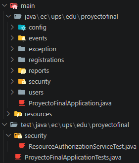

**Evidencia 2. Persistencia en PostgreSQL**

La captura confirma que las tablas principales fueron creadas en PostgreSQL. Se evidencian las entidades necesarias para usuarios, roles, eventos, sesiones, inscripciones, tokens de refresco y auditoría, junto con la estructura generada mediante migraciones.

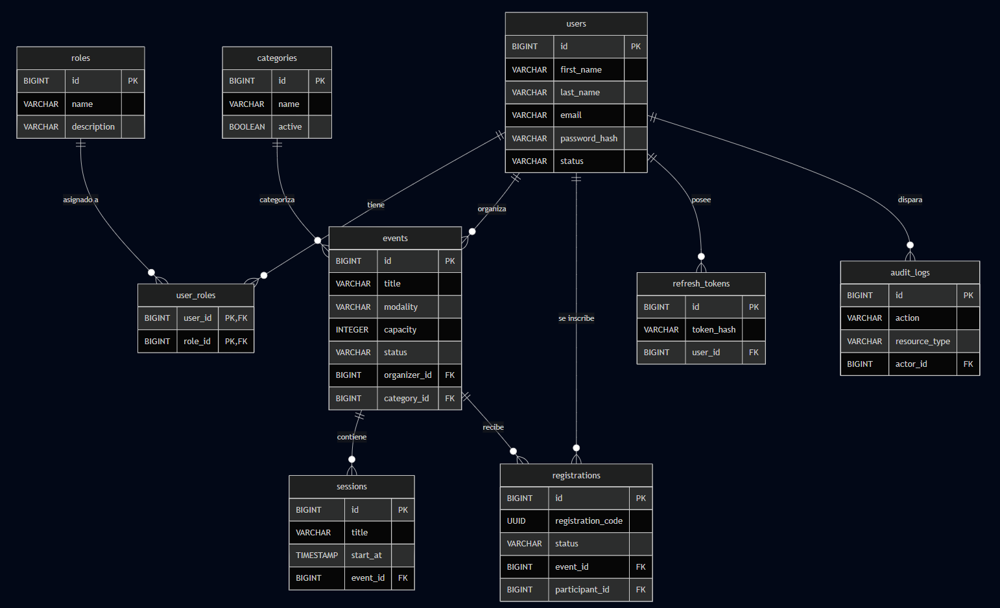

### Seguridad, autenticación y autorización

**Evidencia 3. Control de acceso por roles y propiedad**

La respuesta `403 Forbidden` demuestra que la API bloquea acciones no autorizadas. Esta prueba valida que no basta con estar autenticado: el sistema también revisa el rol del usuario y la propiedad del recurso antes de permitir una operación.

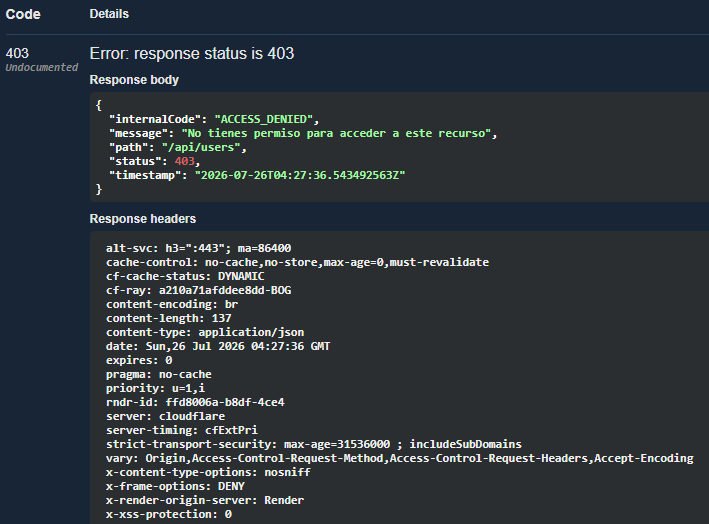

**Evidencia 4. Documentación de endpoints**

Swagger UI lista los controladores y operaciones disponibles de la API. Esta evidencia permite verificar que los módulos principales están expuestos de forma documentada y que los endpoints pueden probarse desde una interfaz única.

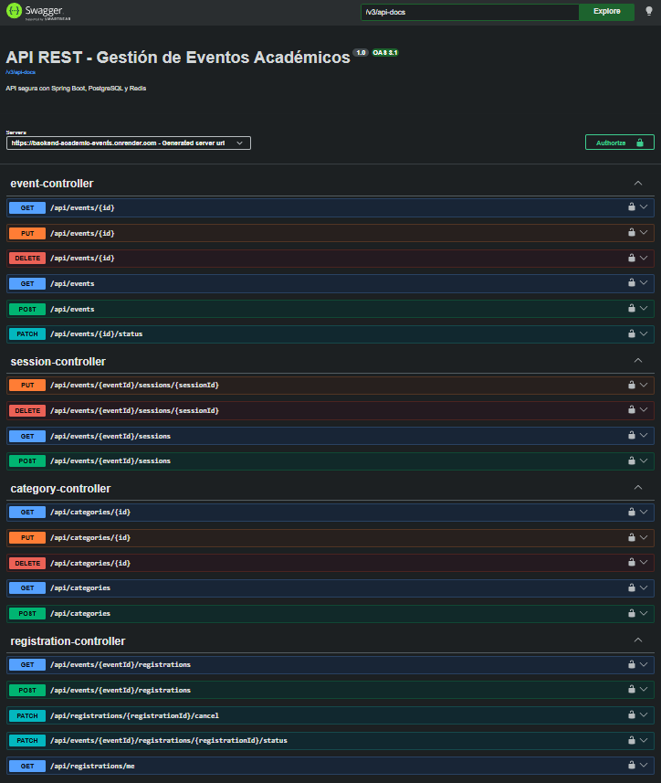

**Evidencia 5. Protección de Swagger con Basic Auth**

La ventana de autenticación Basic muestra que la documentación no queda pública sin control. El acceso a Swagger requiere credenciales independientes del JWT usado por la API.

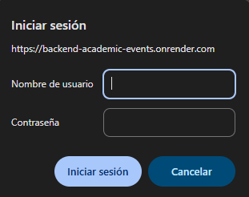

**Evidencia 6. Login con JWT**

La captura de login exitoso demuestra que el sistema autentica credenciales válidas y devuelve tokens para consumir endpoints protegidos. Los valores sensibles fueron ocultados para evitar exponer tokens reales en el repositorio.

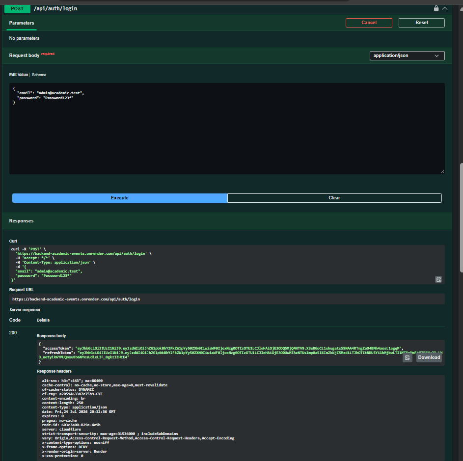

**Evidencia 7. Refresh token o cierre de sesion**

La prueba del flujo de refresh o logout evidencia que la autenticación no se limita al login inicial. El backend permite renovar tokens de forma controlada y revocar sesiones cuando el usuario cierra sesion.

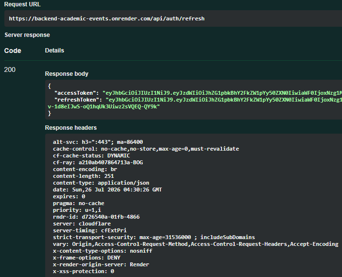

### Redis, límites y errores controlados

**Evidencia 8. Claves temporales en Redis**

La captura de Redis muestra llaves temporales creadas por la aplicación, como contadores de login o límites de solicitudes. Esto confirma que Redis se usa como almacenamiento temporal con expiración, no como base de datos principal.

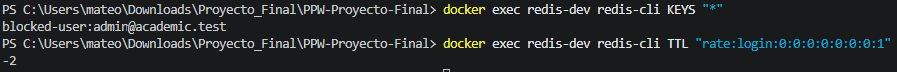

**Evidencia 9. Rate limiting activo**

La respuesta `429 Too Many Requests` confirma que la API limita solicitudes repetidas. Esta protección reduce abuso en endpoints sensibles como login, registro y reportes.

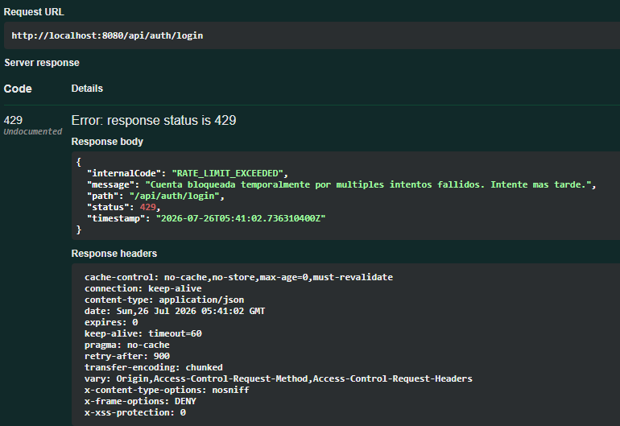

**Evidencia 10. Reglas de negocio**

La captura muestra una respuesta controlada ante una acción inválida, como intentar duplicar un registro o incumplir una regla del dominio. Esto evidencia que las validaciones no dependen solo de la base de datos, sino también de la capa de servicio.

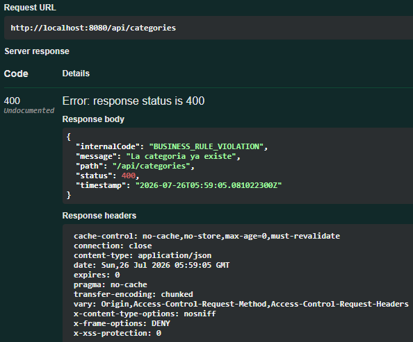

**Evidencia 11. Manejo uniforme de errores**

La respuesta JSON demuestra que los errores se devuelven con una estructura consistente. El formato incluye datos como estado HTTP, mensaje, código interno, fecha y ruta, lo que facilita depuración y consumo desde clientes externos.

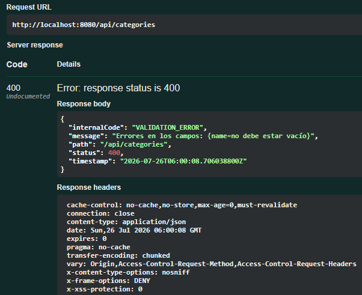

### Reportes, estadísticas y pruebas

**Evidencia 12. Reporte PDF de inscritos**

La descarga del PDF confirma que el módulo de reportes genera archivos bajo demanda. El acceso se controla por rol y propiedad del evento, por lo que solo administradores u organizadores autorizados pueden obtener esta información.

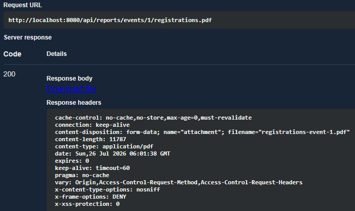

**Evidencia 13. Reporte Excel de inscritos**

La descarga del archivo Excel demuestra que la misma información puede exportarse en un formato procesable. Esto cumple el requerimiento de reportes descargables y facilita análisis fuera de la API.

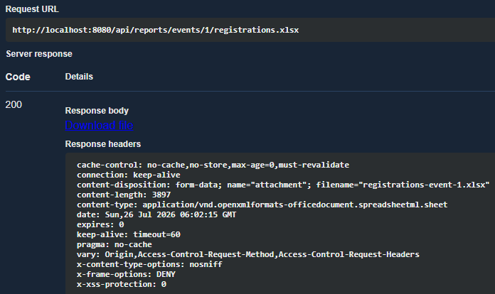

**Evidencia 14. Certificado de inscripción confirmada**

El certificado PDF evidencia que el sistema valida el estado de la inscripción antes de generar documentos para participantes. La generación está restringida a inscripciones confirmadas y usuarios autorizados.

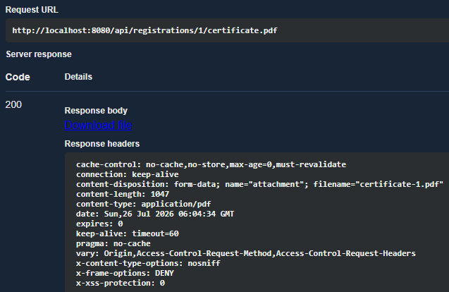

**Evidencia 15. Estadísticas**

La respuesta de estadísticas muestra información agregada por rango de fechas o por evento. Esto demuestra que el backend no solo administra datos operativos, sino que también entrega resultados resumidos para consulta y seguimiento.

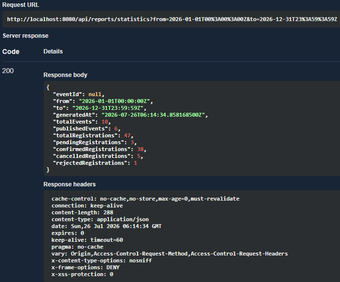

**Evidencia 16. Pruebas automatizadas**

La ejecución de Gradle con resultado exitoso confirma que el proyecto compila y que las pruebas automatizadas pasan. Esta evidencia respalda la estabilidad mínima del backend después de integrar seguridad, reportes, Redis y configuración.

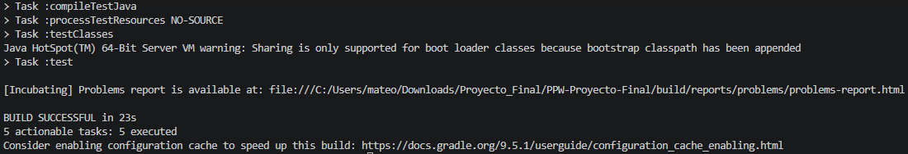

**Evidencia 17. Fechas en formato ISO 8601**

La respuesta JSON muestra fechas serializadas en formato ISO 8601. Esto mantiene compatibilidad con clientes externos y evita ambigüedades de zona horaria al consumir la API.

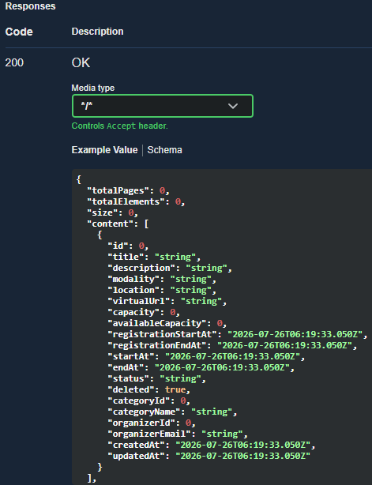

### Producción

**Evidencia 18. Health check en producción**

El endpoint de Actuator responde con estado `UP`, lo que confirma que la aplicación desplegada está disponible. Este endpoint se expone sin detalles internos para comprobar salud sin revelar información sensible.

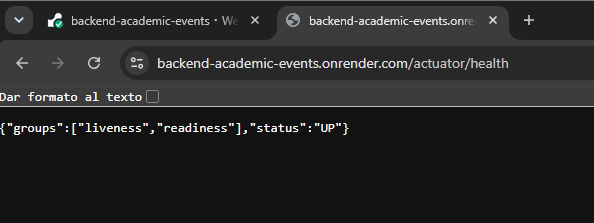

**Evidencia 19. Swagger en producción**

La captura muestra Swagger cargado desde la URL pública del backend. Esto permite comprobar que la documentación también está disponible en el despliegue y conserva las protecciones configuradas.

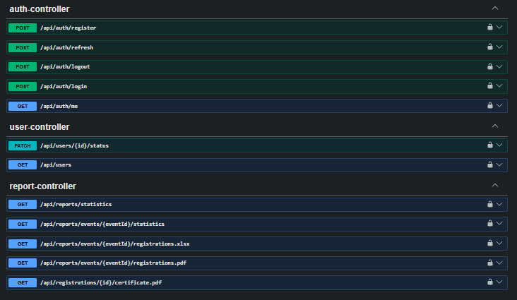

**Evidencia 20. Consumo de endpoint protegido en producción**

La respuesta exitosa de un endpoint protegido demuestra que el despliegue no solo inicia correctamente, sino que permite autenticar y consumir recursos reales de la API usando JWT.

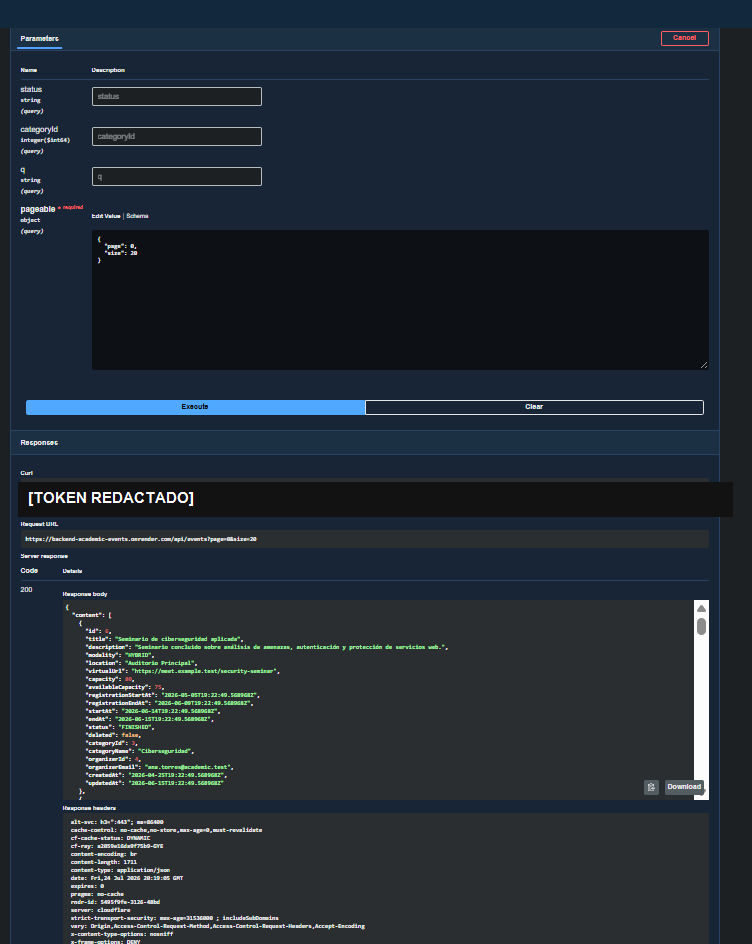

---

## 6. Enlaces de Producción

| Recurso | URL |
|---------|-----|
| API base | `https://backend-academic-events.onrender.com` |
| Swagger UI | `https://backend-academic-events.onrender.com/swagger-ui/index.html` |
| Actuator Health | `https://backend-academic-events.onrender.com/actuator/health` |

Swagger está protegido con:

- Usuario: `evaluator`
- Contraseña: `evaluator123`

---

## 7. Usuarios de Prueba

La base de datos se inicializa automáticamente mediante Flyway con usuarios de prueba.

| Rol | Usuario |
|-----|---------|
| Administrador | `admin@academic.test` |
| Organizador | `maria.cordero@academic.test` |
| Participante | `carlos.velez@academic.test` |

Contraseña común:

```text
Password123*
```

---

## 8. Ejecución Local

### Requisitos

- Java 17 o superior.
- Docker y Docker Compose.
- Git.

### Configurar variables

```powershell
copy .env.example .env
```

### Levantar PostgreSQL y Redis

```powershell
docker compose up -d
```

Servicios locales:

| Servicio | Puerto |
|----------|--------|
| PostgreSQL | `5433` |
| Redis | `6379` |

### Ejecutar aplicación

```powershell
.\gradlew.bat bootRun
```

### Ejecutar pruebas

```powershell
.\gradlew.bat clean test --console=plain
```

---

## 9. Despliegue en Render

El despliegue se realiza con Blueprint usando `render.yaml`.

Pasos generales:

1. Subir el repositorio a GitHub.
2. Crear un Blueprint en Render.
3. Conectar el repositorio.
4. Verificar que Render cree PostgreSQL, Redis y el servicio web.
5. Confirmar que `JWT_SECRET` se genere de forma segura.
6. Confirmar que `ALLOWED_ORIGINS` no use `*` en producción.
7. Probar Swagger, API y Actuator Health desde la URL pública.

---

## 10. Seguridad de Evidencias

Las capturas publicadas evitan exponer tokens JWT, contraseñas reales, secretos de entorno o credenciales privadas. Cuando se muestran respuestas autenticadas, los valores sensibles se encuentran ocultos o recortados para conservar la evidencia funcional sin comprometer la seguridad del proyecto.

---

## 11. Conclusiones

El proyecto integra los principales contenidos de la asignatura en una API REST completa: arquitectura modular, seguridad JWT, autorización por roles, persistencia relacional, Redis, rate limiting, validaciones, reportes descargables, observabilidad y despliegue en producción.

La solución permite demostrar no solo ejecución local, sino también funcionamiento desde una URL pública con Swagger protegido, health check y evidencias de consumo de endpoints reales.
